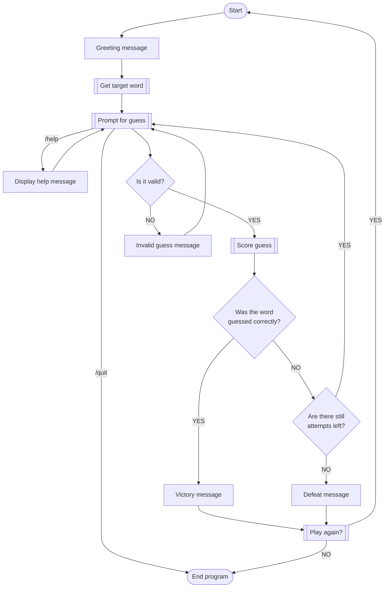

# Wordle Game
### Rules
- Players must guess the 5-letter word in 6 total guesses.
- Only 5-letter words are accepted and words that are in the word bank.
    - If you input an invalid guess, this will not use up an attempt.
- Type `/quit` to end the program, or `/help` to display instructions.

### Entire program flowchart

