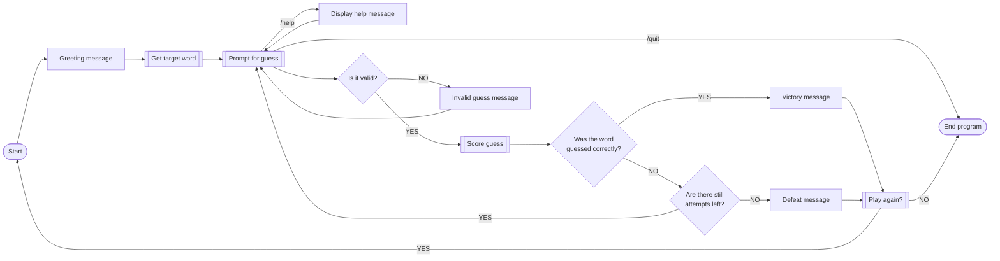
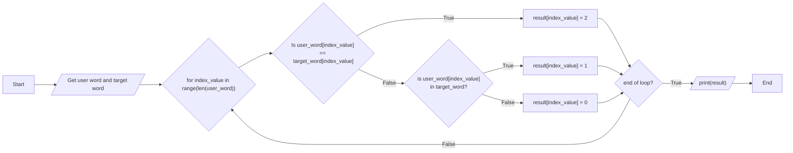

# Wordle Game
### Rules
- Players must guess the 5-letter word in 6 total guesses.
- Only 5-letter words are accepted and words that are in the word bank.
    - If you input an invalid guess, this will not use up an attempt.
### Useful commands 
- `/quit` - end the program.
- `/giveup` - reveal the answer and end the run.
- `/help` - displays helpful information.
### Entire program flowchart

### Score Guess Algorithm

